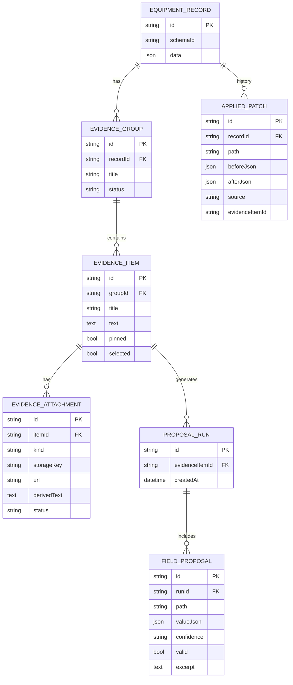
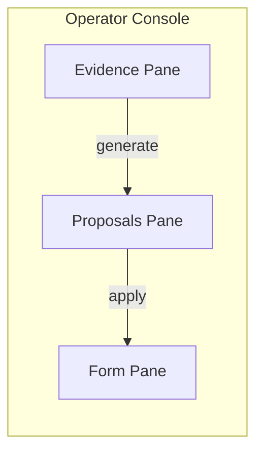
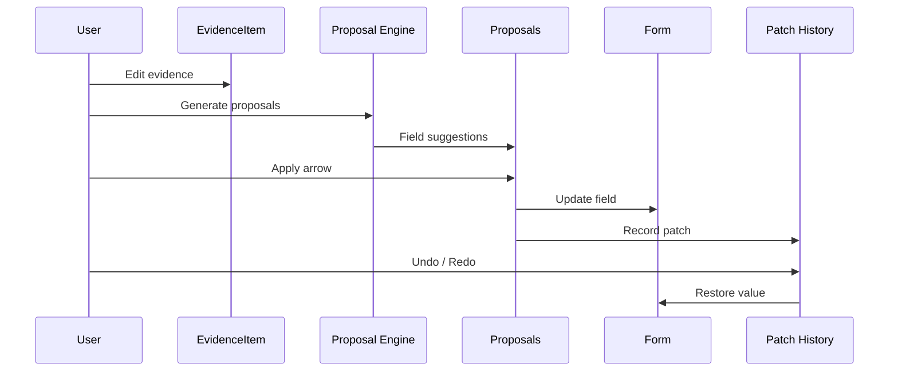
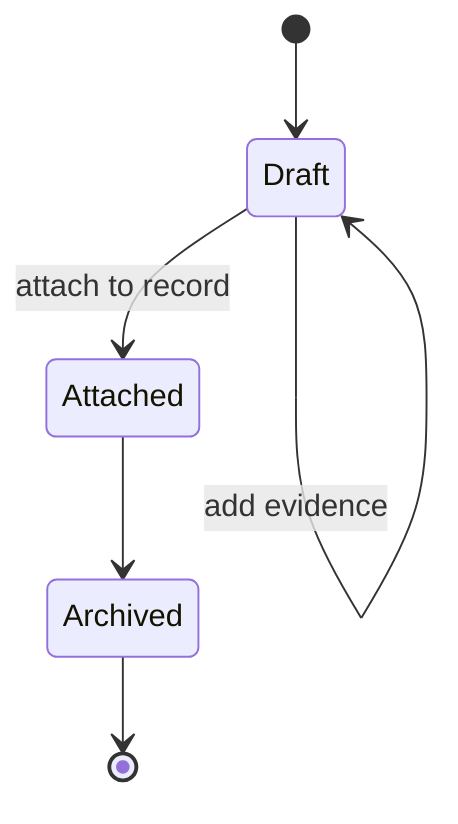

# ARCHITECTURE.md

# Evidence-Driven Schema Editor — Architecture

## Big Picture Flow

```mermaid
flowchart LR
  A[Unstructured inputs\nnotes • OCR • audio • URLs • PDFs] --> B[Evidence Items\n(titled text blobs)]
  B --> C[Proposal Engine\n(LLM + validators)]
  C --> D[Field Proposals\n(per-field suggestions)]
  D --> E[Operator UI\nEvidence | Proposals | Form]
  E -->|Apply arrow| F[Patch]
  F --> G[Structured Record\n(Zod truth)]
  F --> H[Provenance\n(evidence refs)]
  F --> I[Undo/Redo\n(history)]
```

---

## Data Model



---

## Operator UI Layout



---

## Patch Lifecycle



---

## Draft Groups



---

## Philosophy

AI suggests.  
Humans commit.  
Every value has a receipt.
